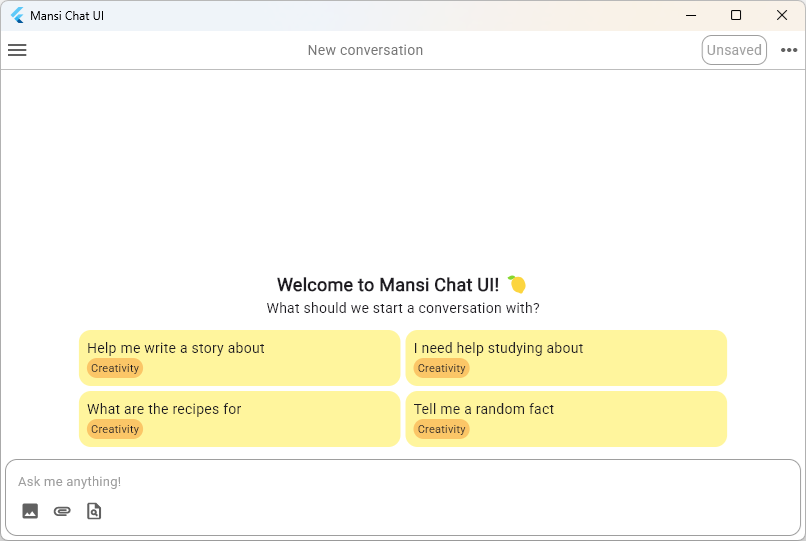

# Mansi - A Flutter-based AI Chat UI 🍋

Ang Mansi ay ginagawa upang makipag-usap ng LLM galing sa iba't ibang tagapagbigay, na madalas gamitin at walang bayad o pahinumdom.
> Paalala: Ang gawang ito ay nasa maagang yugto lamang. Samakatuwid, maaring ipagharap ang suliranin sa [Issues](https://www.github.com/pochicake/mansi/issues)!

# Download

Sa pangkat dito, maari mong isalinlapat sa anumang gamit mo:

## Desktop

- [Windows_x86](https://www.github.com/pochicake/mansi/releases/download/v0.1.0/Mansi_Windows_x86_64_v0.1.0.zip)
- ~~Linux_x86~~ *(Unavailable)*
- ~~MacOS~~ *(Unavailable)*

## Mobile

- ~~Android_arm64~~ *(Unavailable)*
- ~~iOS~~ *(Unavailable)*

> Kung wala dito ang hinahanap na ulat, maari rin bumuo ng sariling ulat. Tingnan ang tagubilin [dito](docs/pagbuo.md).

# Handog

Kung naibigan mong gawain na ito, maari rin magbigay ng makatulong gamit sa mga nasa ibaba. Salamat sa pag-ambag mo!

- 🍵 KoFi - [pochi](https://www.ko-fi.com/pochicake)

# Pahintulot

Ang gawaing ito ay nasasaklaw ng pahintulot na GPLv3, tingnan ang [LICENSE](LICENSE) upang maunawaan ang buong kasunduan.